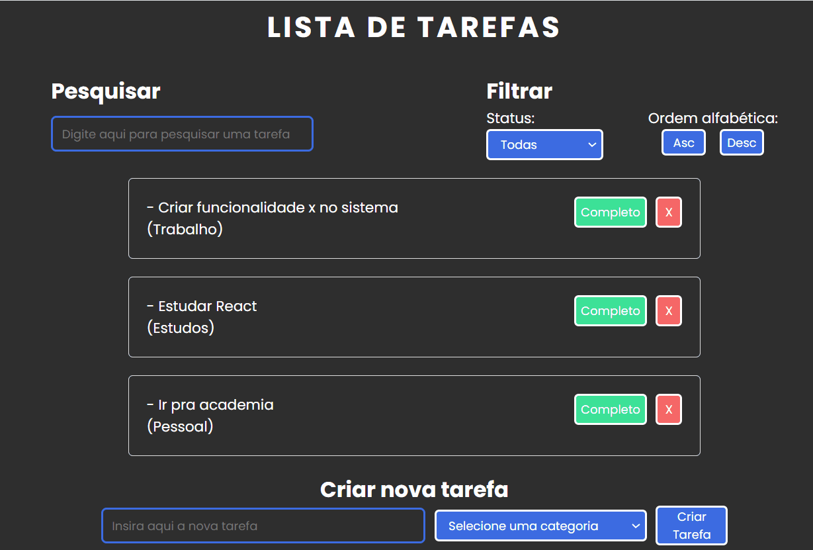

# Todo Do List

 ## Veja como ficou o projeto:
 
 ## Desktop:
  
  
  ## Mobile:
   
  
   
  ## Do que se trata esse projeto?
Aprimorando as habilidades utilizando React em mais um projeto.
Desta vez, trata-se de um lista de tarefas com várias funcionalidades.

## Quais interações são realizadas?
- O usuário pode inserir nova tarefa, selecionando sua categoria.
- É possível sinalizar a tarefa como concluída.
- É possível excluir uma tarefa.
- É possível filtrar uma categoria específica.
- É possivel ordenar as tarefas em ordem alfabética.

  
## Habilidades desenvolvidas:
- Uso da biblioteca REACT para melhor divisão do código, com o uso de componentes e props,deixando assim o código mais limpo e de fácil entendimento,
 facilitando futuras manutenções.
- Uso de hooks.
- Uso de métodos Javascript como filter,sort,map.
- Uso de funções e condições Javascript.

## Linguagens Utilizadas:
- HTML 

- CSS  

- JAVASCRIPT  

## Biblioteca utilizada:

-REACT      
          

Para ver o projeto pronto, [CLIQUE AQUI!](https://jessica-os.github.io/shopping-cart/)
